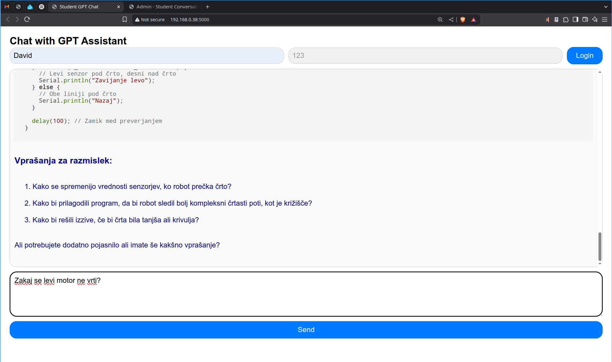
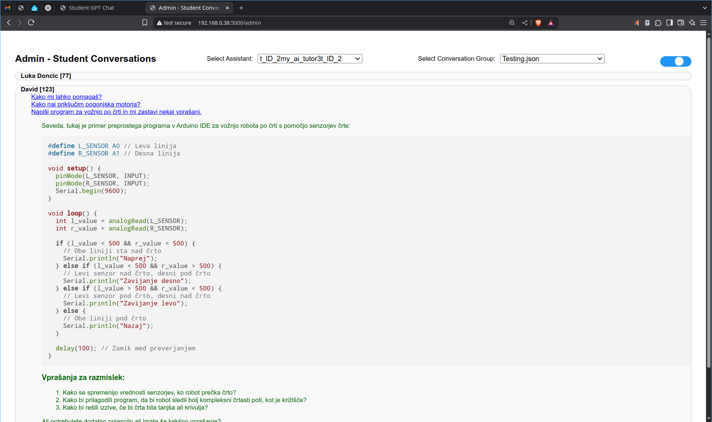

# AI Tutor

AI Tutor je spletna aplikacija, ki omogoča študentom/dijakom/učencem klepet z GPT asistentom. Vključuje tudi administrativni vmesnik za upravljanje pogovorov študentov.

## Način uporabe

### Študentski vmesnik

1. Odprite glavno stran za klepet z navigacijo na osnovni URL (`https://UČITELJEV_IP_NASLOV:5000`).
2. Vnesite svoje ime in po želji svojo študentsko številko.
3. Kliknite gumb "Prijava" za začetek seje.
4. Vnesite svoja vprašanja v vnosno polje za sporočila in kliknite "Pošlji" za klepet z GPT asistentom.

{#fig:Ai_tutor_student}

### Administrativni vmesnik

1. Odprite administrativno stran z navigacijo na `https://127.0.0.1/admin`.
2. Izberite asistenta iz spustnega menija.
3. Izberite skupino pogovorov za ogled pogovorov.
4. Preklopite status vnosnega polja za sporočila z drsnikom.

{#fig:Ai_tutor_teacher}

## Namestitev

### Potrebna programska oprema

- Python 3.17 ali novejša različica
- Dodatne Python knjižnice (navedene spodaj)
- Beležnica za urejanje `*.json` datotek (Notepad++, Sublime text, Notepad)

### Potrebne knjižnice

- Flask
- OpenAI

Namestite te knjižnice z naslednjim ukazom:
```sh
pip install flask openai
```

### Priprava okolja

1. Klonirajte repozitorij:
    ```sh
    git clone https://github.com/davidrihtarsic/AI_tutor.git
    cd AI_tutor
    ```

2. Ustvarite virtualno okolje in ga aktivirajte:
    ```sh
    python3 -m venv venv
    source venv/bin/activate
    ```

3. V mapi `/config` spremenite ime datoteke `config.example.json` v `config.json`. Nato spremenite vsebino te datoteke z vašim OpenAI API ključem in ID-ji asistentov:
    ```json
    {
        "api_keys": {
            "default_key": "sk-proj-***************************************lUA"
        },
        "assistants": {
            "Pomocnik_pri_skupinskem_delu": {
                "openai_assistant_id": "asst_7U******************Wdrs",
                "instructions": ""
            },
            "Pomocnik_za_preverjanje_znanja": {
                "openai_assistant_id": "asst_xg******************Qxzq",
                "instructions": ""
            }
        }
    }
    ```

4. Ustvarite novo datoteko za nove pogovore. Datoteka se mora nahajati v mapi `conversations`. Najbolje, da skopirate prazno predlogo pogovorne datoteke 
    ```sh
    cp ./conversations/sample_class.json ./conversations/2025_04_prosti_pad.json
    ```

5. Zaženite aplikacijo:
    ```sh
    python3 AiTutor.py
    ```

6. Odprite svoj spletni brskalnik in navigirajte na `http://localhost:5000` za študentski vmesnik ali `http://localhost:5000/admin` za administrativni vmesnik.


## Licenca

Ta projekt je licenciran pod CC BY-SA licenco.
